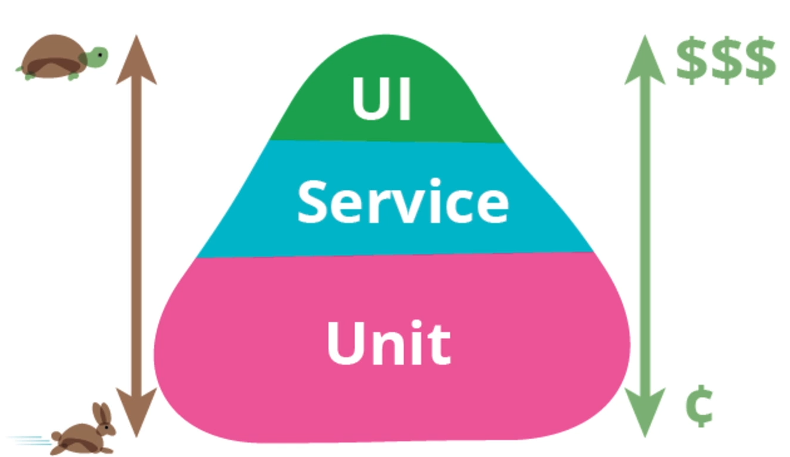

# Níveis de Testes

## Efeito borboleta

- "O bater das asas de uma borboleta pode causar um tornado do outro lado do planeta";
- No desenvolvimento é igual a essa teória, uma simples linha de código mal colocada, pode arruinar toda uma funcionalidade e dependendo da funcionalidade pode arruinar até mesmo um sistema por inteiro.
- Os testes surgem para que possamos validar se novas funcionalidades não estão causando problemas com as funcionalidades antigas ou até mesmo, validar se a nova funcionalidade de fato está funcionando como deveria.

## Piramide de teste

 

- Base | testes unitários, local aonde eu divido os códigos em porções mínimas, geralmente usado para testar métodos novos, em testes unitários, como estamos isolando pedaços de código, temos que isolar também o que será usado para validar se aquele método está 100%, logo usamos o mockito, ou o mock,  criamos um ambiente temporario para validar os dados, podendo substituir o banco de dados na maioria dos casos, portanto estes testes tendem a custar mais barato;
- Service | aqui já estamos falando de integração de partes do código, estamos falando de componentes conversando entre si, pontas conversando entre si, como uma API REST por exemplo, os testes nesta camada tendem a ser mais custosos do que unitário, porém são os testes mais importantes para serem explorados, pois estamos validando o que de fato está indo para a aplicação;
- UI | cama de testes funcionais, a cama que cobre o que o usuário consegue enxergar, que cobre o que o usuário vai testar, o que o usuário vai usufluir.

## Um exemplo de código e teste

**Exemplo do Método de Login**

**Exemplo de teste unitário do método de Login**

- Teste focado na lógica do método;

**Exemplo de teste de service (teste integrado)**

- Neste exemplo temos um teste integrado, já com sua URL sendo passada por parametro, e logo após temos a necessidade de todas as nossas API's estarem ligadas, pois a massa de dados vai precisar bater em algum lugar para confirmar esse cara;

**Exemplo de Teste Funcional**

- Teste sob a visão do usuário;