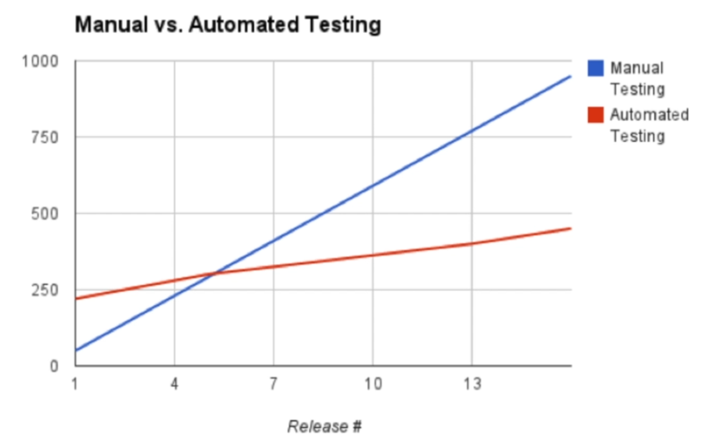

# Importância da automação

## Como funcionam os testes funcionais

- Classes de equivalência (pesquisar sobre)
  - Ele observa isso em uma tela de login, e já imagine os seguintes testes:
    - Endereço de e-mail invalido | teria uma frase criticando o e-mail
    - E-mail não cadastrado | mensagem de usuário inexistente
    - E-mail cadastrado e senha errado | mensagem de login invalido
    - E-mail e senha corretos | login feito com sucesso

**Regra 10 de Myers**

Escritor do livro a arte de testes de software

"O custo para correção de bugs, aumenta em 10 vezes para vez que o projeto de desenvolvimento de software avança"

## Teste funcional deve ser executado cedo

Quanto mais cedo no projeto os testes funcionais forem executados, mais fácil é de detectar possíveis falhas que venham a ocorrer durante o processo de desenvolvimento do projeto;
Um bom momento para os testes funcionais serem criados, é na fase de construção do projeto, aonde os códigos começam a ser gerados;
Sendo assim, uma saída para economizar os custos com a correção de bugs durante o projeto, seria executar os testes integrados sempre que alguém alterasse algo no projeto, que ai seria uma bateria de regressão, praticamente todos os dias.

Problematica:
- Alguém ter que rodar uma bateria de 100 testes funcionais todos os dias
- Reportar sempre que aparecer um erro
- dificuldade de encontrar alguém que queira fazer isso

Solução:
- Automatizar essa rotina de bateria de testes;

## Testes manuais x Testes automatizados

- Inicialmente os testes manuais tem vantagem sobre os testes automatizados;
- A longo prazo o manual se torna mais custoso, por exigir mais horas para serem executados e montados;
- A automação é feita apenas uma vez e após feita pode ser executada repetidas vezes;
- Podemos usar a base de uma automação para automatizar cenários parecidos poupando tempo;
- Testes automatizados podem se aproveitar de outros testes para serem criados mais facilmente;
- Mais velocidade na execução da automação;

