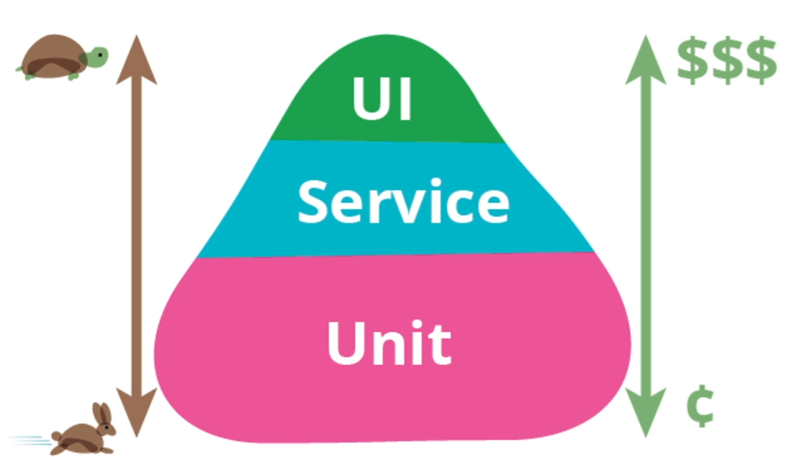

# Pirâmide de testes

- Teste unitário não precisa de quase nada para funcionar;
- Custo de ambiente, custo com o tempo necessário para executar os testes, 10000 mil testes unitários em 10 segundos, é o mesmo que 1 teste funcional, logo o custo dos testes unitários;
- Custo com o tempo de desenvolvimento, custo com o ambiente, custo de manutenção nos testes funcionais.

