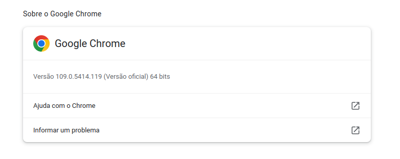
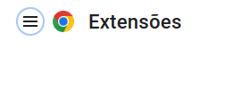
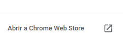
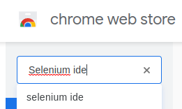
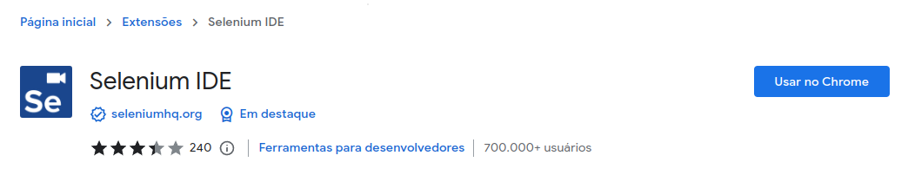
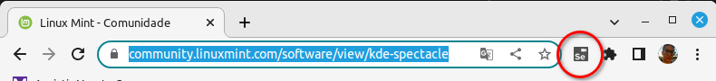
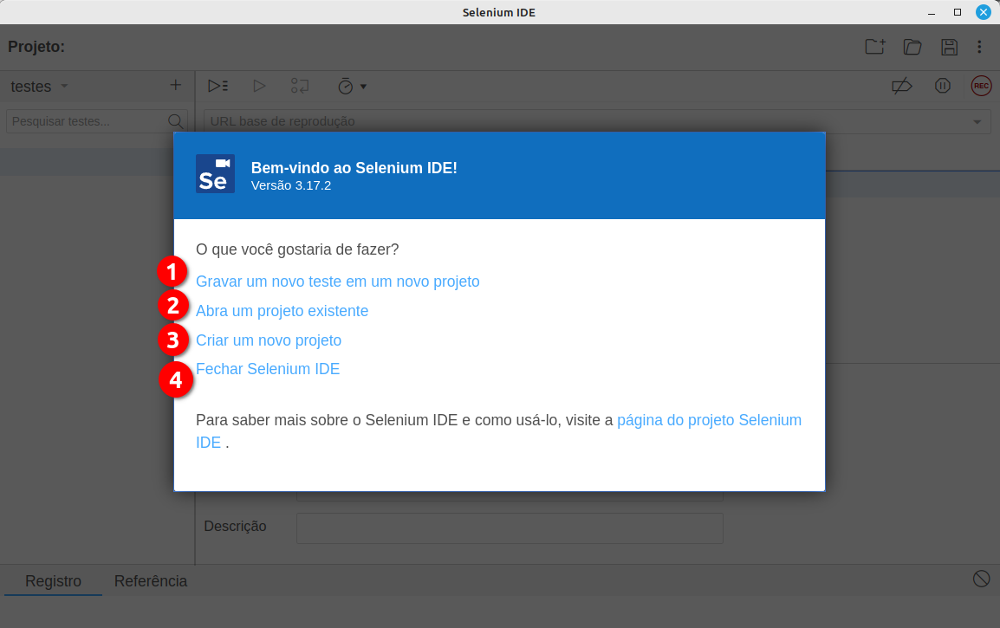
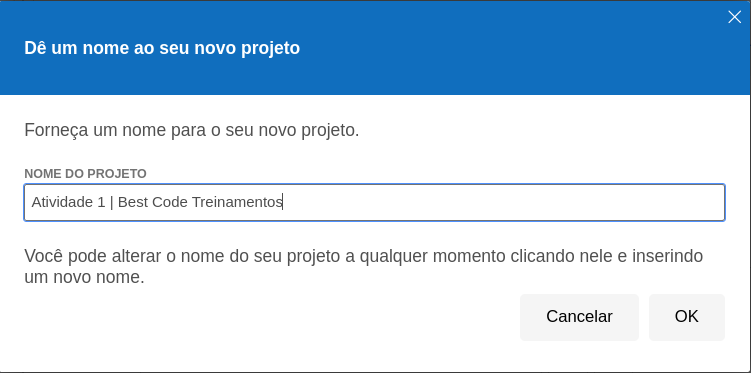
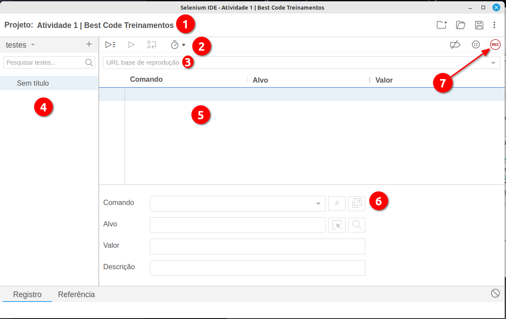
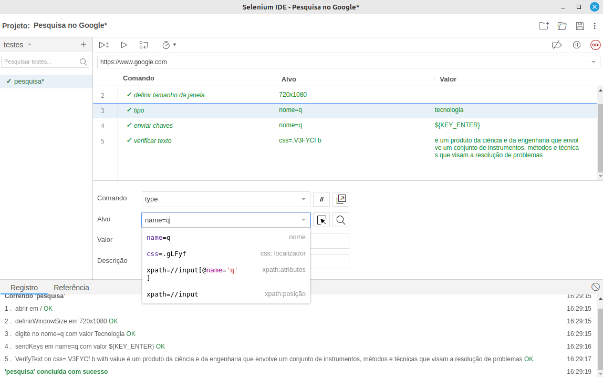

# Selenium IDE

Ferramenta para automação de tarefas via browser, através de captua de comportamento;

## Navegadores aceitos
Hoje em dia temos tanto para Google Chrome, como para Firefox, antigmaneto só o firefox era suportado, em ambos você precisa aplicar o pluggin para funcionar;

**Google Chrome**

- Pegue a versão atual do seu chrome em "Ajuda", fica no menu, na parte superior direta do navegador;
- Logo após clique em Ajuda;
- A versão atual estará na tela;

- Logo após vá até a aba extensões do Chrome;
- Clique no hamburguer na lateral esquerda superior da tela;

- Logo após clique em Chrome Web Store

- Logo após abrir a Web Store, pesquise por "Selenium IDE"

- Clique no selenium IDE e vá no botão usar no Chrome;

- Basta habilitar a extensão agora e ser feliz.

## Por dentro do Selenium IDE

Por se tratar de uma ferramenta de recording play, ele grava todas as ações que o usuário vai fazer a partir do momento em que ele preciona o REC, para gravar a automação, porém antes mesmo de apertar o REC temos algumas configurações que precisam ser feitas.

**Selenium IDE Plugin**

Nesta imagem acima, temos o icone do Selenium IDE, que é o local aonde você deve realizar o clique para iniciar a automação via recording play.

Nesta tela temos os botões inicias do Selenium IDE, que a tela de inicio da ferramenta, as respectivas opções fazem o seguinte:
1. Grava um novo teste dentro de um projeto já existente, que neste caso, depende de você já ter feito um projeto, e já ter salvo ele nas suas pastas.
2. Abrir um projeto existente funciona semelhante a opção 1, porém nesse caso, você vai abrir algo que já existe, e vai apenas abrir o projeto, não vai criar nada com essa opção de cara.
3. Criar um projeto é a opção que você deve usar todas as vezes que você estiver iniciando um projeto.
4. Fechar o Selenium IDE, é fechar a ferramenta, simples curto e direto.

Tela de novo projeto, aonde você pode inserir o nome desse projeto que você vai conduzir os testes.

Neste tela, temos várias informações importantes para serem passadas:
1. Nome do projeto, é como se fosse uma pasta, que vai guardar todos os seus testes, semelhante ao Excel e seus sistema de planilhas salvas dentro de uma pasta de trabalho;
2. Painel de controle da automação, nesse painel, nós podemos dar play na automação, dar play com debug, dar um loop na automação, calcular o tempo da automação ou até mesmo programar a execução dessa automação no navegador;
3. URL base do projeto, aonde o projeto vai acessar, qual o site, qual a URL padrão de todos os testes;
4. Fila dos testes criados, todo o teste criado vai para aquela lateral esquerda;
5. Os comandos que foram captados durante a gravação ficam nessa parte da tela;
6. Visibilidade dos comandos usados um a um, dando a posibilidade de você alterar alguma coisa nessa parte da tela
7. botão de gravação, é quem dá start a automação que vai acontecer, é nesse botão que podemos iniciar a gravação e parar ela também depois que finalizamos o que nós precivamos fazer;

## Dicas sobre o Selenium IDE

- Ele pode ser uma ótima ferramenta de estudo de seleção de elementos:

Exemplo:

- Acima temos vários exemplos de como selecionar elementos de modos diferentes e isso serve tanto para o IDE como para o WebDriver quando vc estiver capturando campos na sua automação;

