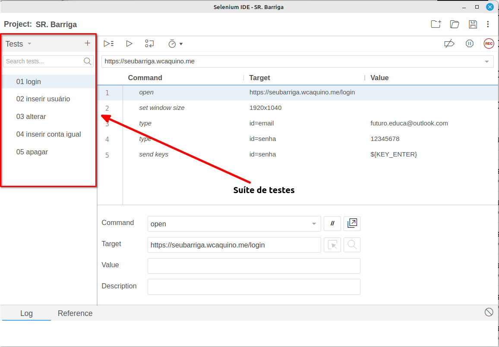

# Suíte de testes

A suíte de testes é quando temos vários testes agrupados e que podem ser executados em uma sequência especifica, eles podem se completar ou não, vai de acordo com a sua necessidade, neste caso que criamos os nossos testes se auto completam e eu até mesmo criei uma numeroligia para que fique mais claro como eles se completam;

## Limitações da ferramenta

- Se o teste inicial falhar, todos os testes vão falhar pois os testes são dependentes uns dos outros;
- Um único testes não pode ser realizado de modo isolado, o exclusão por exemplo não funciona sem os demais serem aplicados também, pois não teria a conta necessária para ser excluída.
- A suíte de testes conforme for crescendo vai ser complexa de manter sua ordem e principalmente vai ficar complexo de dar manutenção no código;

