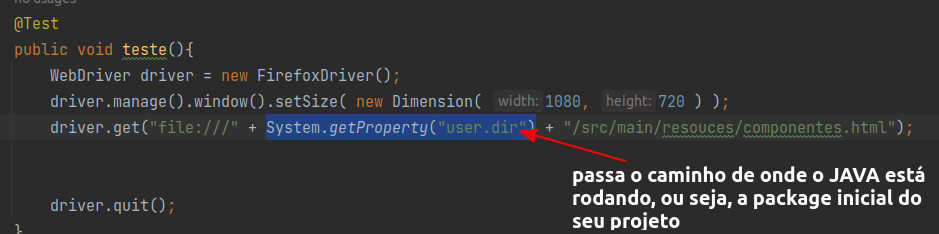

# 1 Elementos básicos : Campo de treinamentos

O campo de treinamento vai ser um local de testes, aonde vamos executar e aprender algumas coisas de modo local, antes mesmo de irmos para a vida real;

## Batendo na aplicação localmente

Uma curiosidade do Selenium Web Driver, é que mesmo que a aplicação rode na sua máquina local, apenas passar o endereço do arquivo não serve, você deve direcionar o caminho do arquivo usando o protocolo dele também, no caso do nosso arquivo o protocolo é o file://

## Configuração do campo de treinamento

Acima tivemos um exemplo de como executar uma página web local do modo incorreto, pois em cada máquina aquilo ali seria diferente, portanto precisamos passar um caminho dinâmico para o nosso projeto, fazendo com que as coisas fiquem mais simples de serem encontradas, neste caso usaremos o nosso package resources para guardar os arquivos.

Na imagem acima estamos concatenando 3 coisas, a primeira é o protocolo file:///, a segunda coisa é o caminho de onde o Java está instalado, que no caso do nosso projeto fica na pasta que iniciar o projeto, e o terceiro é o caminho da página dentro do nosso pacote java, que nesse caso, vai ficar em /src/main/resources.

Nessa aula prontinho, aprendemos a configurar de modo dinâmico o nosso projeto e além disso direcionar como queremos e aonde quisermos que o nosso projeto abra na hora da automação;