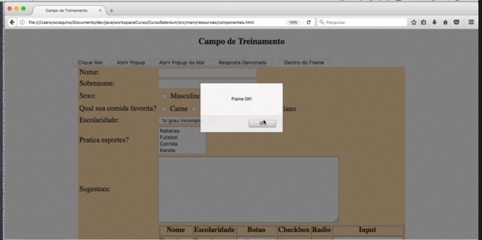

# Frames

O conceito de frames no HTML é quando desejamos inserir o conteúdo de uma página HTML por cima de outra, ou até mesmo dentro de outra página, seja em um pedaço da página, seja em local da página, pode ser até mesmo apenas uma box.

