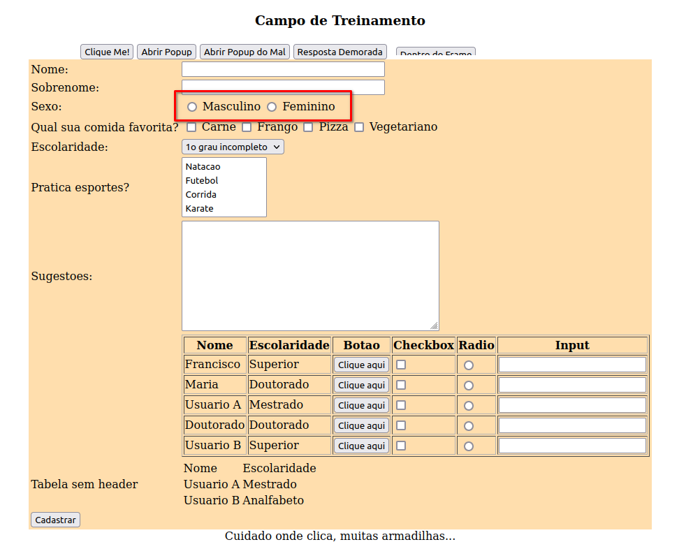
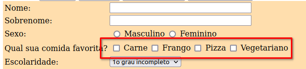

# Radio Button e CheckBox

Aprendendo a interação com Radio Button e Checkbox

## Interação com um Radio Button

A interação com o radio button, ou para os mais leigos as opções de resposta em bolinhas, é mais fácil de acontecer encontrando o elemento e logo após clicando nele, sendo assim vamos ao exemplo:

~~~java
    driver.findElement( By.id("elementosForm:sexo:0") ).click();
~~~

No código acima iremos clicar no botão masculino, mas poderiamos trocar o locator para clicar no femínino também, sem problema algum

## Interação com checkbox

A interação com o checkbox é a mesma que o radio button, a única diferença que para escolher a opção que vc deseja, geralmente a escolha é associada ao value do checkbox e não ao elemento com id em si.

~~~java
    driver.findElement( By.id("elementosForm:comidaFavorita:2") ).click();
~~~

No código acima selecionamos o checkbox da pizza

## Aprendizados a mais nesse exercício 

~~~java
    Assertions.assertTrue( driver.findElement( By.id("elementosForm:comidaFavorita:2") ).isSelected() );
~~~

O que aprendemos de novo nesse exercício foi a utilização do isSelected(), esse metódo nos dá a possibilidade de validar se um elemento está selecionado ou não, o método de retorna um boolean, ou seja, ele casa perfeito com uma validação de assertTrue;

