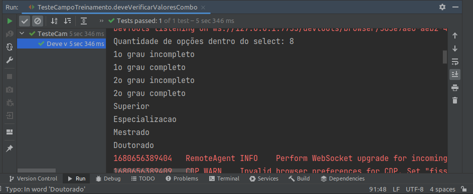

# Combo

Estes campos possuem uma particularidade para selecionar na automação, para você que é novato entender o que é o combo, nada mais é do que aqueles campos que possuem uma lista de itens, que se abrem quando você clicar sobre uma setinha, várias opções se abrem e você pode escolher uma delas;

## O que é o combo

Lista de itens em uma caixinha

## Combo com seleção via index

Toda lista possui um index em sua construção, o index é a ordem dos elementos dentro do html, sendo assim no momento de construir um formulário a ordem em que os itens são inseridos tem uma ordem começando por 0 e indo até x, sendo x a quantidade final de elementos possíveis menos um.

Por exemplo, vamos imaginar a lista a baixo:
- Escolar
- Direito
- Camisa
- Blusa
- Tênis

nesta lista temos 5 itens no total, para que eu possa escolher "Direito", eu preciso ir no index 1, pois a lista começa na posição 0;

~~~java
    WebElement escolaridade = driver.findElement( By.id( "elementosForm:escolaridade" ) );
    Select combo = new Select( escolaridade );
    combo.selectByIndex( 1 );
~~~

No exemplo acima, podemos notar que selecionamos a opção 1 grau completo.

## Combo via Value

O value é uma informação que é declarada como atributo dentro da tag html do formulário, sendo assim é esse dado que vai ser direcionado para o servidor, neste exemplo, precisamos acessar o html para coletar o value que queremos passar;

~~~java
    WebElement escolaridade = driver.findElement( By.id( "elementosForm:escolaridade" ) );
    Select combo = new Select( escolaridade );
    combo.selectByValue( "superior" );
~~~

## Combo via VisibleText | O texto que aparece na caixa

O VisibleText é uma informação que fica na caixa de select do formulário, neste exemplo, precisamos apenas digitar a opção que queremos selecionar do jeito que está escrito na opção, esse modelo de seleção é o mais indicado pra usar, pois por ele conseguimos validar inclusive se está tudo ok com a escrita;

~~~java
    WebElement escolaridade = driver.findElement( By.id( "elementosForm:escolaridade" ) );
    Select combo = new Select( escolaridade );
    combo.selectByVisibleText( "Superior" );
~~~

## Como validar se está na opção certa com o Junit

para que possamos validar primeiramente qual a opção foi selecionada, precisamos usar o selenium para identificar o primeiro item selecionado, portanto, usaremos o seguite código em java:

~~~java
    combo.getFirstSelectedOption().getText();
~~~

Acima temos um método que vai validar a primeira opção que selecionamos e vai gravar o texto que está dentro do select, podemos validar se a opção que escolhemos foi a selecionada usando assertEquals:

~~~java
    Assertions.assertEquals( "Mestrado"  , combo.getFirstSelectedOption().getText() );
~~~

Estamos validando se a String "Mestrado" é o que retorna no combo ali na expectativa;

## Curiosidades

Por padrão o findElement retorna uma instância de WebElement, que por padrão não é necessário ser alterado, mas em alguns casos é importante que possamos criar uma variação dessa classe em especifico, portanto nesse exemplo que usamos no combo, nós criamos uma instância de WebElement chamada de escolaridade, para que pudessemos criar particularidades especificas para o combo.
No exemplo utilizamos a escolaridade como parametrô do objeto Select, informando em um novo Select(escolaridade), ou seja, o elemento que escolaridade que encontramos na tela para realizar a seleção.

~~~java
    WebElement escolaridade = driver.findElement( By.id( "elementosForm:escolaridade" ) );
        Select combo = new Select( escolaridade );
        combo.selectByIndex( 3 );
        combo.selectByValue( "superior" );
        combo.selectByVisibleText( "Superior" );
~~~

**Podemos usar laços de repetição para poder validar as opções que existem dentro de uma lista**

~~~java
    boolean encontrou = false;
    for( WebElement option: options ){
        System.out.println(option.getText());
        if( option.getText().equals( "Doutourado" ) ){
            encontrou = true;
            break;
        }
    }
    Assertions.assertTrue(encontrou);
~~~

O retorno disso no console fica assim:

